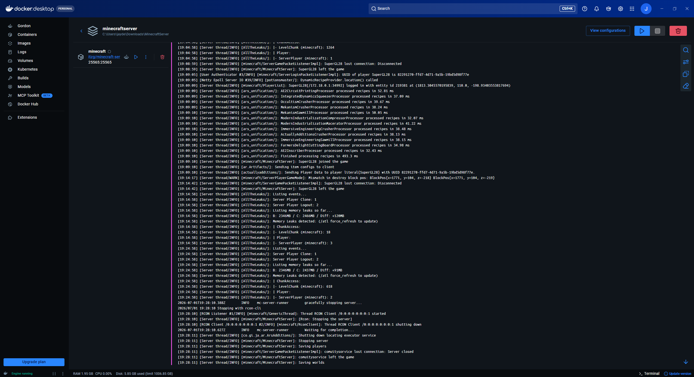

First Experement: Building a stable minecraft server for buddies to play on (started May 2026)

This experiment is done with no knowledge prior of networks or minecraft servers.

5/13/26:

  -Created a container for the minecraft server using Docker
  
  -Configured server settings such as dedicated RAM, server rules, Java image, and modpacks

  
5/14/26:

  -Learned about port and network connectivity
  
  -Configured server's port
  
  -Downloaded Playit.gg as a tool for external connectivity
  
  -Found and downloaded server side mods and downloaded main modpack

5/16/26: 
  -Looked into the docker-compose.yml file which is server configuration
  
  -Tweaked memory allocation and allocated 12 gb of RAM
  
  -Started vanilla mineceraft server for the first time, server is working and friends can join
  

5/17/26: 

  -Installed modpacks onto server and reload
  
  -ran into an error after executing "docker compose up -d" (command for docker to read compose and create server)
  
  -Found out that the image the server was running was the wrong image; changed to java 21
  
  -Ran docker compose up -d again and successfully made container for the modded server
  
  
5/18/26:

  -Friends wanted a different modpack, watched video on how to deactivate the container and then install the new modpack:
  
    -Press stop to stop the server
    
    -run "docker compose down"
    
    -delete all server data but keep docker-compose.yml 
    
    -Find right image and set image within the docker-compose.yml file
    
    -set server rules and memory allocation within the same docker-compose.yml file
    
    -once done, run "docker compose up -d"
    
    -Once docker has created the server, playit.gg should still be connected and the server will be joinable
    
    -however mods are not installed yet so run "docker compose down"
    
    -add modpack and make sure it's compatible with the image you put in the docker-compose.yml file
    
    -run "docker compose up -d"
    
    -server is now operational with mods installed
    
  -I didn't run into any problems because I didn't have to change the image the server was running on because the modpack was made for the same verison of minecraft
  
  -Docker server running 

